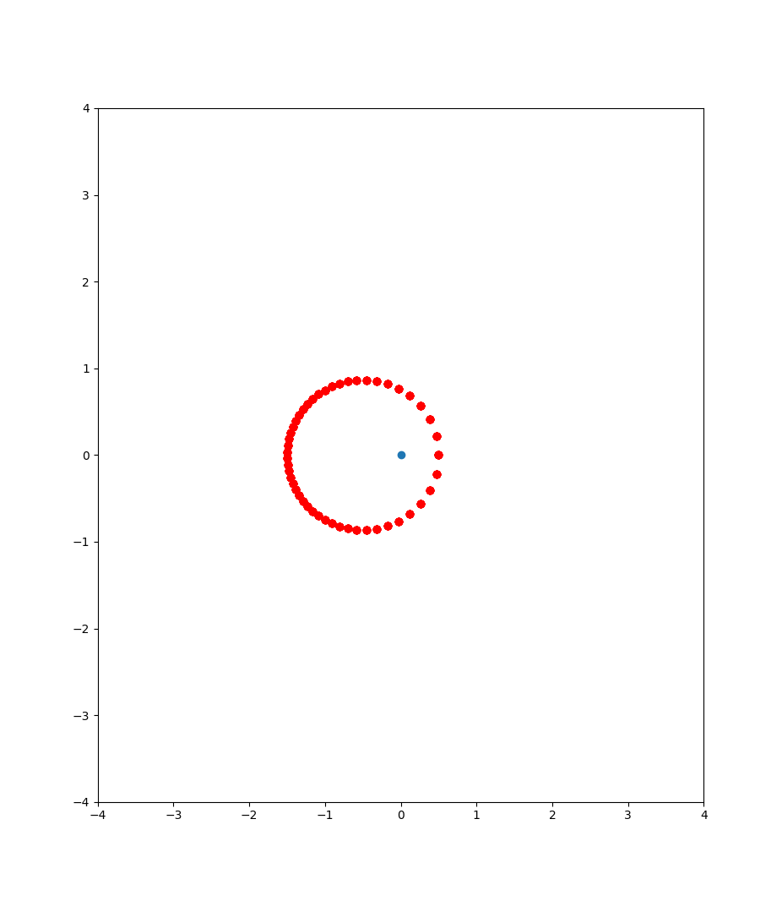
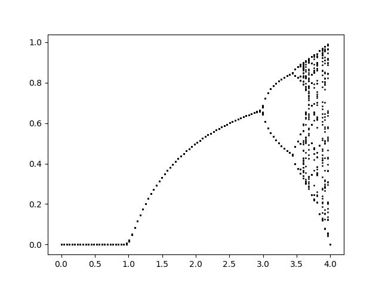
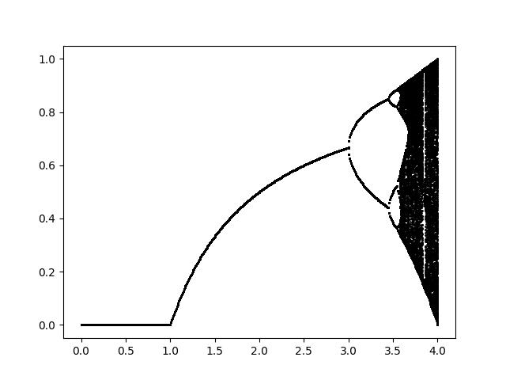
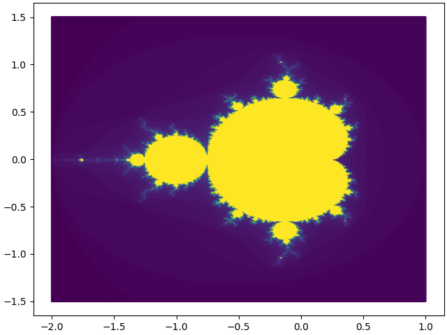
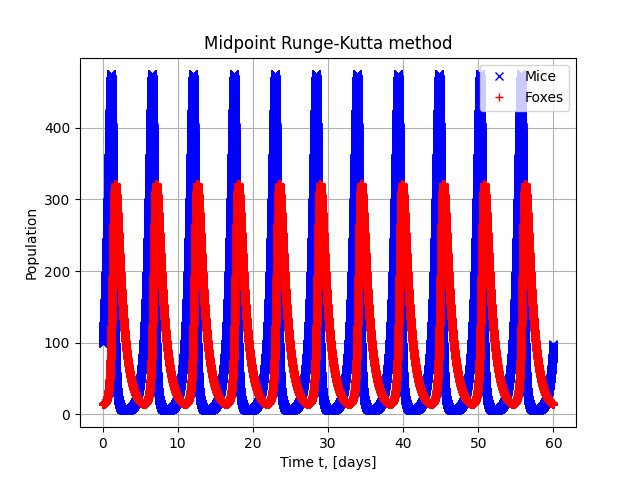
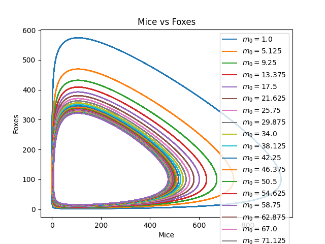

# ESC201: Simulations in Natural Sciences

Numerical methods demonstrated with python, see `requirements.txt` for dependencies.

## Exercise 1: Basic Numerical Solvers

[The exercise](./ex01/numeric_loop_solving.py)

## Exercise 2: Newton's Method and Kepler's Equation

[The exercise](./ex02/kepler.py)

## Exercise 3: Population growth, chaos and fractals

[Feigenbaum simple implementation](./ex03/feigenbaum_simple.py)

[Feigenbaum meshgrid implementation](./ex03/feigenbaum_meshgrid.py)

## Exercise 4: Fractals using Complex Numbers

[Fractals implementation](./ex04/fractals.py)

## Exercise 5: Ordinary Differential Equations

[Fractals implementation](./ex05/lotka-voltera.py)

## Exercise 13:

Optional
