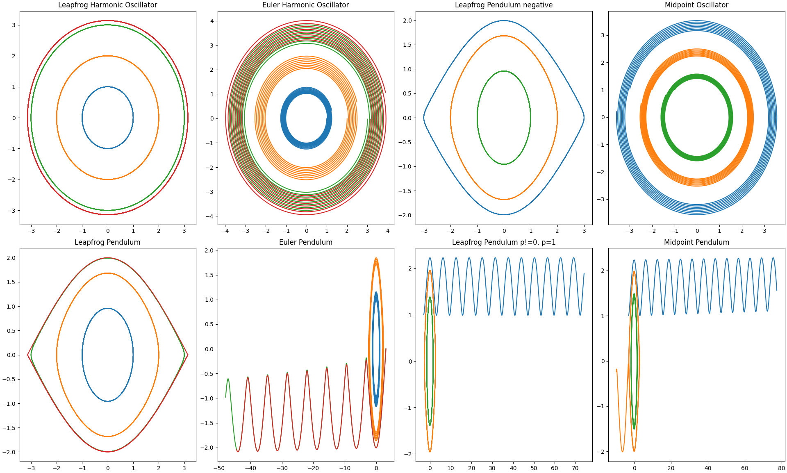
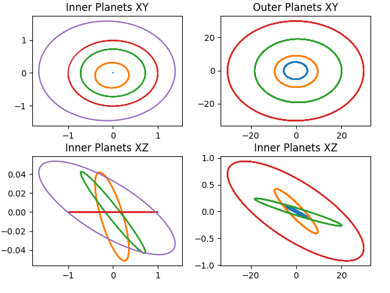
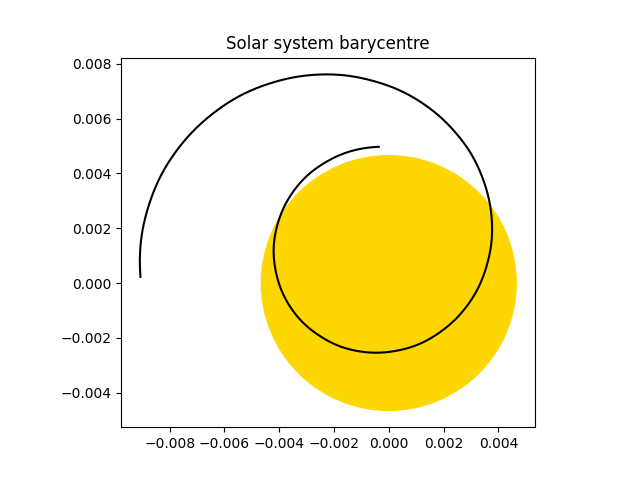
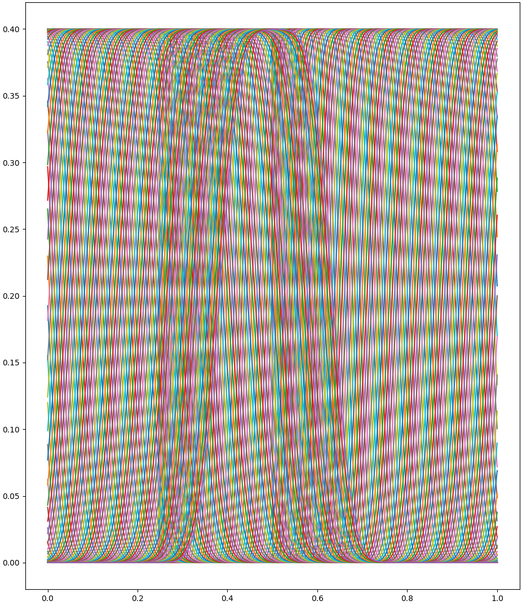
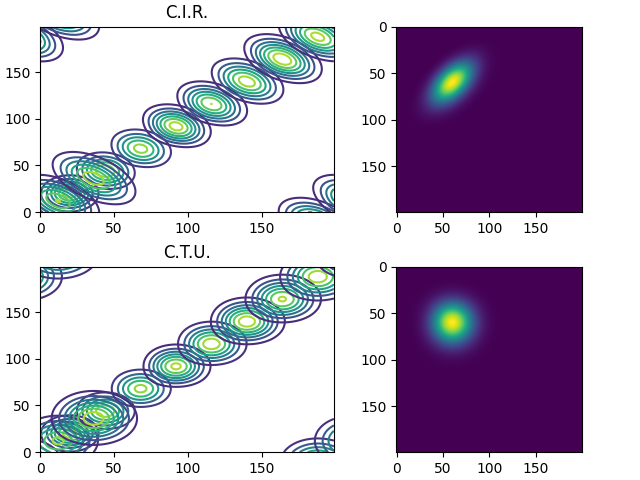

# ESC201: Simulations in Natural Sciences

Numerical methods demonstrated with python, see `requirements.txt` for dependencies.

## Exercise 1: Basic Numerical Solvers

[The exercise](./ex01/numeric_loop_solving.py)

## Exercise 2: Newton's Method and Kepler's Equation

[The exercise](./ex02/kepler.py)

## Exercise 3: Population growth, chaos and fractals

[Feigenbaum simple implementation](./ex03/feigenbaum_simple.py)

[Feigenbaum meshgrid implementation](./ex03/feigenbaum_meshgrid.py)

## Exercise 4: Fractals, Julia Set, Mandelbrot

[Fractals implementation](./ex04/fractals.py)

## Exercise 5: Lotka-Volterra, Forward Euler, Runge-Kutta

[Lotka-Volterra Implementation with mices and foxes](./ex05/lotka-voltera.py)

## Exercise 6: Simplectic Integrators (ODEs)

[Leap-frog example implementation](./ex06/leapfrog.py)

## Exercise 7: N-Body Problem, Solar System Orrey

[Implementation](./ex07/solar_system_orrey.py)

## Exercise 8: PDEs

[Implementation](./ex08/sweeps.py)

## Exercise 9: Bilinear (& Bicubic) Interpolation

[Implementation](./ex09/laplace_electron.py)

## Exercise 11: Hyperbolic PDEs

[Implementation](./ex11/hyperbolic_pde.py)

## Exercise 12: Finite Volume, Flux

[Implementation](./ex12/finite_volume.py)

